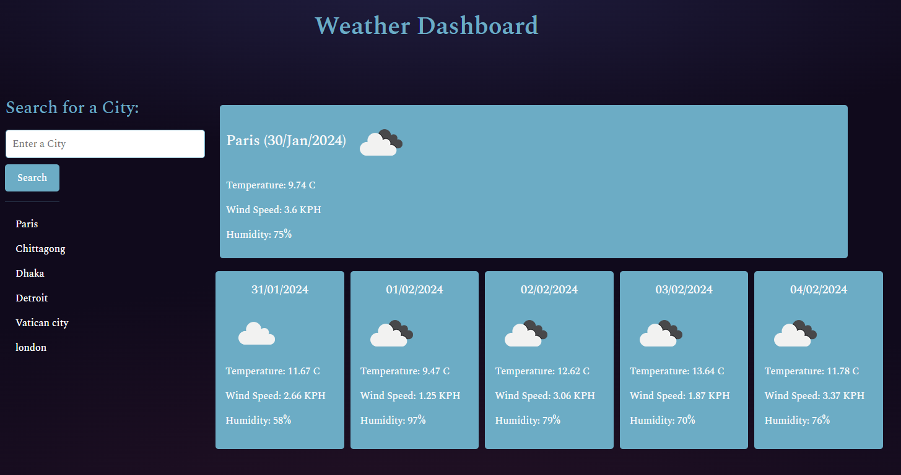

# Module 8 : Weather-App

## Description

This week's challenge was to create an app that allows users to see the weather forecast for cities of their choosing. As with all other this app too will run in the browser and feature dynamically updated HTML and CSS powered by jQuery as well as API calls from OpenWeather Api. 

## Functionality

When the user opens the app, enters a city, then today's weather is displayed as well as the weather data for five days. 

##  Usage
To see the weather for the day, please navigate to  https://kashfeeh.github.io/Weather-App/

## Contributions
As always, as I am a complete novice in this field, any contributions to improve or correct the work would be highly appreciated. The repository is public. So if you have comments 
or suggestions to make this better, then please follow the steps mentioned below:
* Create a branch for the project
* Create your feature branch (git checkout -b feature/title)
* Commit your Changes (git commit -m 'message')
* Push to the branch (git push origin feature/title)
* Open a Pull Request

## References
A lot of code was repurposed from the following websites: 
* https://developer.mozilla.org/en-US/docs/Web/API/Element/prepend, 
* https://gomakethings.com/adding-elements-to-the-beginning-of-a-group-with-vanilla-js/, 
* https://www.w3schools.com/jquery/html_empty.asp,
* https://www.codereadability.com/constructing-html-with-templates/,
* https://dev.to/iamcymentho/building-a-complete-weather-app-from-scratch-with-html-css-and-javascript-a-step-by-step-guide-30h4,
* https://www.studytonight.com/post/how-to-build-a-weather-app-using-javascript-for-complete-beginners

## License
Distributed under the MIT License. See LICENSE.txt for more information.
